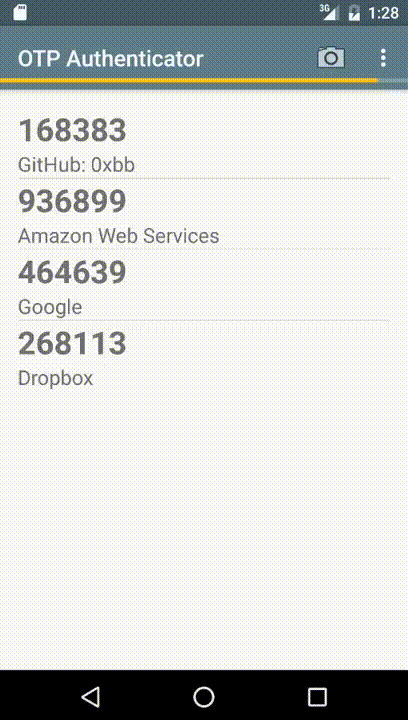
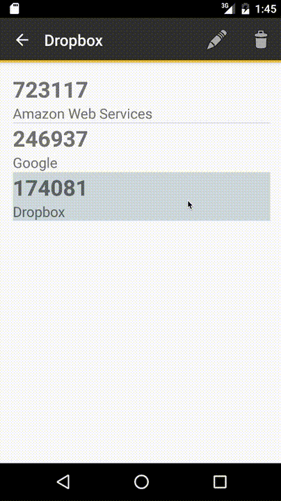
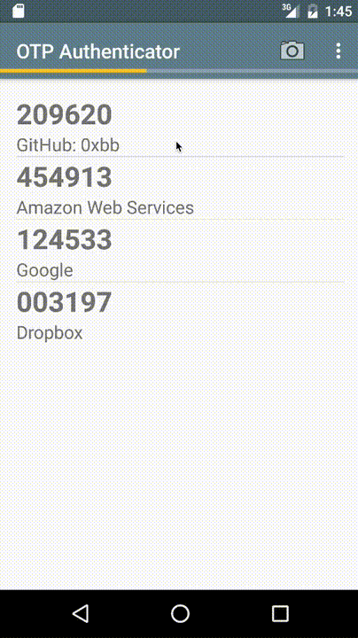
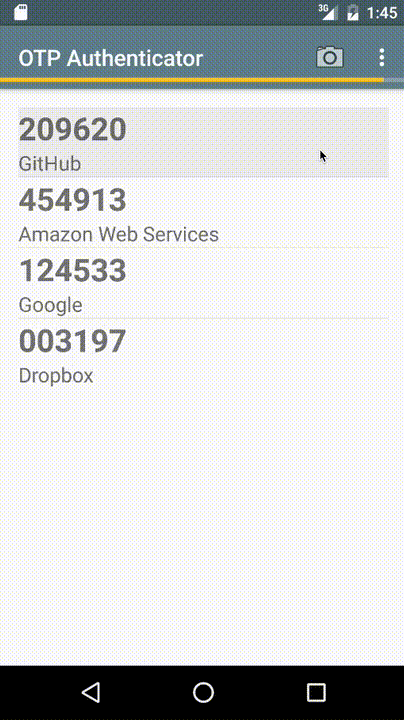

#  OTP Authenticator [](https://travis-ci.org/0xbb/otp-authenticator)


OTP Authenticator is a two-factor authentication App for Android 4.0+. 

It implements Time-based One-time Passwords (TOTP) like specified in RFC 6238.  
Simply scan the QR code and login with the generated 6-digit code.


## Features:
- Free and Open-Source
- Requires minimal permissions
  - Only camera access for QR code scannning
- Encrypted storage on Android 4.3+
- Sleek minimalistic Marterial Design
- Great Usability 

## Download:


## Screenshots:
### Overview:


### Rearranging Accounts:


### Renaming Accounts:


### Deleting Accounts:



## License:
```
Copyright (C) 2015 Bruno Bierbaumer
Permission is hereby granted, free of charge, to any person obtaining a copy of
this software and associated documentation files (the "Software"), to deal in the
Software without restriction, including without limitation the rights to
use, copy, modify, merge, publish, distribute, sublicense, and/or sell copies of
the Software, and to permit persons to whom the Software is furnished to do so,
subject to the following conditions:
The above copyright notice and this permission notice shall be included in all
copies or substantial portions of the Software.
THE SOFTWARE IS PROVIDED "AS IS", WITHOUT WARRANTY OF ANY KIND, EXPRESS OR IMPLIED,
INCLUDING BUT NOT LIMITED TO THE WARRANTIES OF MERCHANTABILITY, FITNESS FOR A PARTICULAR
PURPOSE AND NONINFRINGEMENT. IN NO EVENT SHALL THE AUTHORS OR COPYRIGHT HOLDERS BE
LIABLE FOR ANY CLAIM, DAMAGES OR OTHER LIABILITY, WHETHER IN AN ACTION OF CONTRACT,
TORT OR OTHERWISE, ARISING FROM, OUT OF OR IN CONNECTION WITH THE SOFTWARE OR THE USE
OR OTHER DEALINGS IN THE SOFTWARE.
```
